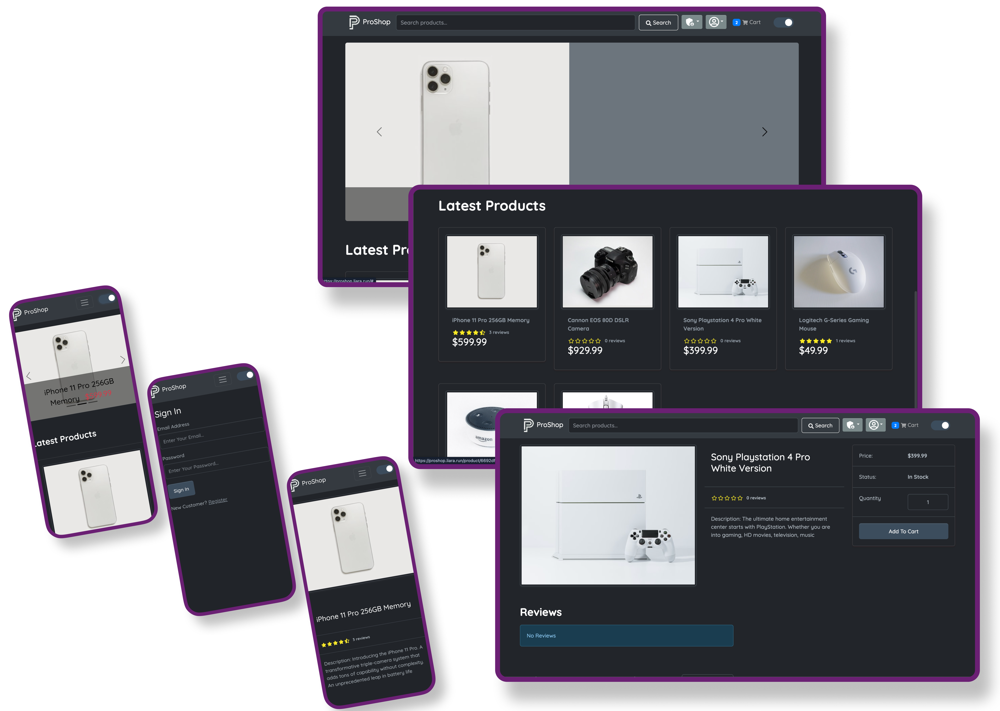

# ProShop - MERN eCommerce Platform (Nest backend)



Full-featured eCommerce platform built with MongoDB, React, and a NestJS (Express) backend in TypeScript. Features include product catalog, shopping cart, user authentication, admin panel, order management, PayPal integration, and dark/light theme support.

## 🚀 Features

### Customer Features

- **Product Catalog** - Browse products with search, pagination, and top products carousel
- **Product Reviews & Ratings** - Customer reviews and 5-star rating system
- **Shopping Cart** - Add/remove items, quantity management, persistent cart
- **User Authentication** - Register, login, logout with JWT tokens
- **User Profile** - Manage personal information and view order history
- **Checkout Process** - Multi-step checkout with shipping and payment
- **PayPal Integration** - Secure payment processing
- **Order Tracking** - View order status and details
- **Theme Support** - Dark/light mode toggle

### Admin Features

- **Admin Dashboard** - Comprehensive admin panel
- **Product Management** - Create, edit, delete products with image upload
- **User Management** - View, edit, delete user accounts
- **Order Management** - View all orders, mark as delivered
- **Inventory Control** - Stock management and product categorization

### Technical Features

- **TypeScript** - Full TypeScript implementation for type safety
- **Responsive Design** - Mobile-first responsive UI with Bootstrap
- **State Management** - Redux Toolkit for efficient state management
- **API Integration** - RESTful API with proper error handling
- **File Upload** - Multer integration for product images
- **Security** - JWT authentication, password hashing, input validation
- **SEO Optimized** - React Helmet for meta tags and SEO

## 🛠️ Tech Stack

### Frontend

- **React 18.3** - Modern React with hooks and functional components
- **TypeScript 5.2** - Type-safe JavaScript development
- **Redux Toolkit 1.9** - State management with RTK Query
- **React Router 6.10** - Client-side routing
- **Bootstrap 5.2** - Responsive UI framework
- **React Bootstrap 2.7** - Bootstrap components for React
- **Vite** - Fast build tool and development server
- **PayPal React SDK** - PayPal payment integration
- **React Helmet Async** - SEO and meta tag management
- **React Toastify** - Toast notifications
- **Moment.js** - Date formatting and manipulation

### Backend

- **Node.js** - JavaScript runtime environment
- **NestJS (Express)** - Structured API framework
- **TypeScript 5.5** - Type-safe server development
- **MongoDB + Mongoose 7** - NoSQL database & ODM
- **JWT** - JSON Web Token authentication (HttpOnly cookie)
- **bcryptjs** - Password hashing
- **Multer** - File upload handling
- **Morgan** - HTTP request logger
- **Cookie Parser** - Cookie parsing middleware

### Development Tools

- **Nodemon** - Development server auto-restart
- **Concurrently** - Run multiple commands simultaneously
- **ESLint** - Code linting and formatting
- **Prettier** - Code formatting
- **ts-node / ts-node-dev** - TypeScript execution for Node.js

## 📋 Prerequisites

- Node.js (v16 or higher)
- MongoDB (local installation or MongoDB Atlas)
- npm or yarn package manager

## 🚀 Installation & Setup

1. **Clone the repository**

   ```bash
   git clone <repository-url>
   cd proshop
   ```

2. **Install dependencies**

   ```bash
   npm install
   ```

3. **Environment Configuration**
   Create a `.env` file in the root directory (also used by Nest backend):

   ```env
   NODE_ENV=development
   PORT=3000
   MONGODB_URL=mongodb://localhost:27017/proshop
   MONGO_URI=mongodb://localhost:27017/proshop
   MONGO_DB=proshop
   JWT_SECRET=your_jwt_secret_key
   PAYPAL_CLIENT_ID=your_paypal_client_id
   ```

4. **Database Setup**

   ```bash
   # Import sample data (optional)
   npm run data:import

   # Destroy sample data (if needed)
   npm run data:destroy
   ```

## 🏃‍♂️ Running the Application

### Development Mode

```bash
# Client (Vite)
npm run client

# Server (Nest)
npm run server:dev
```

### Production Mode

```bash
# Build client + server
npm run build   # builds server and client

# Start production server (serves /api and client dist)
npm run server:start
```

The application will be available at:

- **Frontend**: http://localhost:5173 (development via Vite) or http://localhost:3000 (production served by Nest)
- **Backend API**: http://localhost:3000/api

## 📁 Project Structure

```
proshop/
├── backend/                 # Legacy Express backend (kept for reference; Nest replaces it)
│   ├── controllers/         # Route controllers
│   ├── data/               # Sample data and seeder
│   ├── dtos/               # Data Transfer Objects
│   ├── middlewares/        # Custom middleware
│   ├── models/             # Mongoose models
│   ├── routes/             # API routes
│   ├── start/              # App configuration
│   ├── types/              # TypeScript type definitions
│   └── server.ts           # Entry point
├── server/                 # NestJS backend (current API)
│   ├── src/
│   │   ├── auth/           # Auth guards/decorators
│   │   ├── common/         # Filters
│   │   ├── config/         # Config controller (e.g., PayPal)
│   │   ├── order/          # Orders module
│   │   ├── product/        # Products module
│   │   ├── upload/         # Upload controller/module
│   │   └── user/           # Users module
│   ├── tsconfig*.json
│   └── dist/               # Compiled output
├── client/                 # Frontend React application
│   ├── public/             # Static assets
│   ├── src/
│   │   ├── api/            # API service layer
│   │   ├── app/            # Redux slices
│   │   ├── components/     # Reusable components
│   │   ├── layout/         # Layout components
│   │   ├── pages/          # Page components
│   │   ├── store/          # Redux store configuration
│   │   ├── theme/          # Theme management
│   │   ├── types/          # TypeScript interfaces
│   │   └── utils/          # Utility functions
│   └── vite.config.ts      # Vite configuration
├── uploads/                # File upload directory
└── package.json           # Root package configuration
```

## 🔌 API Endpoints (Nest)

### Authentication

- `POST /api/users/register` - User registration
- `POST /api/users/auth` - User login
- `POST /api/users/logout` - User logout

### Products

- `GET /api/products` - Get all products (with pagination & search)
- `GET /api/products/top` - Get top-rated products
- `GET /api/products/:id` - Get single product
- `POST /api/products/:id/review` - Create product review (Protected)
- `POST /api/products` - Create product (Admin)
- `PATCH /api/products/:id` - Update product (Admin)
- `DELETE /api/products/:id` - Delete product (Admin)

### Orders

- `GET /api/orders/myorders` - Get current user's orders (Protected)
- `POST /api/orders` - Create order (Protected)
- `GET /api/orders/:id` - Get order by id (Protected)
- `PATCH /api/orders/:id/pay` - Mark order as paid (Protected)
- `GET /api/orders` - Get all orders (Admin)
- `PATCH /api/orders/:id/deliver` - Mark order as delivered (Admin)

### Uploads

- `POST /api/upload` - Upload product image (Admin, form-data field `image`)

### Config

- `GET /api/config/paypal` - PayPal client id

### Orders

- `POST /api/orders` - Create new order (Protected)
- `GET /api/orders/myorders` - Get user orders (Protected)
- `GET /api/orders/:id` - Get order by ID (Protected)
- `PATCH /api/orders/:id/pay` - Update order to paid (Protected)
- `GET /api/orders` - Get all orders (Admin)
- `PATCH /api/orders/:id/deliver` - Mark order as delivered (Admin)

### Users

- `GET /api/users/profile` - Get user profile (Protected)
- `PATCH /api/users/profile` - Update user profile (Protected)
- `GET /api/users` - Get all users (Admin)
- `GET /api/users/:id` - Get user by ID (Admin)
- `PATCH /api/users/:id` - Update user (Admin)
- `DELETE /api/users/:id` - Delete user (Admin)

### File Upload

- `POST /api/upload` - Upload product image (Admin)

## 🎨 Features in Detail

### Theme System

The application includes a sophisticated theme system supporting both light and dark modes with persistent user preferences.

### State Management

Redux Toolkit with RTK Query provides efficient state management and API caching, reducing unnecessary network requests.

### Authentication & Authorization

JWT-based authentication with role-based access control. Admin users have additional privileges for managing products, users, and orders.

### Payment Integration

Secure PayPal integration for payment processing with order status tracking.

### File Upload

Multer-based file upload system for product images with proper validation and storage management.

## 🚀 Deployment

The application is configured for deployment on Liara (Iranian cloud platform) with disk mounting for file uploads. Configuration is available in `liara.json`.

### Build for Production

```bash
npm run build
```

This will:

1. Install client dependencies
2. Compile TypeScript backend code
3. Build optimized client bundle
4. Prepare for production deployment

## 🤝 Contributing

1. Fork the repository
2. Create a feature branch (`git checkout -b feature/amazing-feature`)
3. Commit your changes (`git commit -m 'Add amazing feature'`)
4. Push to the branch (`git push origin feature/amazing-feature`)
5. Open a Pull Request

## 👨‍💻 Author

**Hossein Rezaei**

---

Built with ❤️ using the MERN stack and TypeScript
